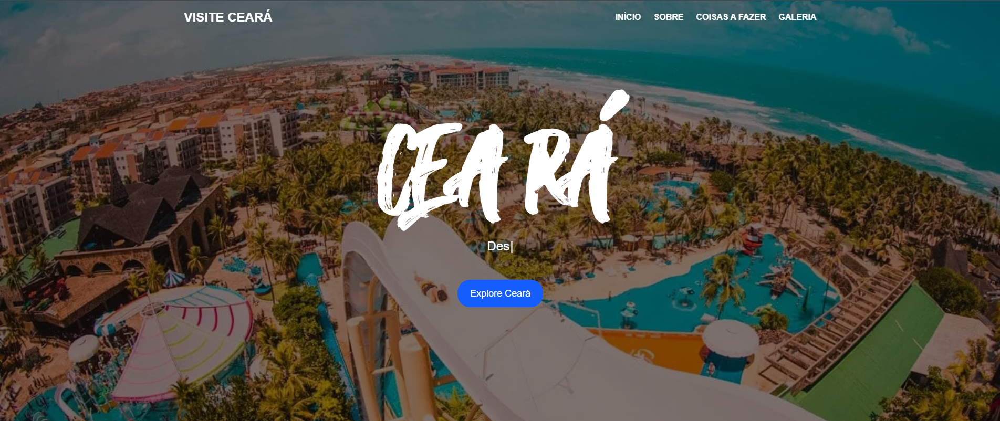

# 🌴 Visite Ceará

 

---

## 📌 Descrição do Projeto

**Visite Ceará** é uma aplicação web interativa desenvolvida com o objetivo de apresentar os principais pontos turísticos do estado do Ceará, promovendo e incentivando o turismo local. O projeto une tecnologia, design e informações geográficas para criar uma experiência imersiva e visualmente atrativa para os visitantes.


---

## 🛠️ Tecnologias Utilizadas

- Next.js 
- React.js
- Tailwind CSS
- Leaflet - Biblioteca de mapas leves e altamente personalizáveis
- JSON Server (ou simulação local) - Simulação de uma API com dados dos pontos turísticos
- Framer Motion (animações de elementos)

---

## 🧭 Funcionalidades

- 🗺️ **Mapa interativo com Leaflet**  
  Exibição dinâmica dos principais pontos turísticos utilizando a biblioteca Leaflet, com marcadores customizados e zoom controlado.

- 🔗 **Requisição de dados via API fake (JSON)**  
  Os dados dos pontos turísticos são simulados com uma API local (utilizando JSON) e consumidos dinamicamente no mapa.

- 🎯 **Sidebar com lista dos locais**  
  Navegação lateral com os nomes dos pontos turísticos. Ao clicar, o mapa centraliza automaticamente no ponto escolhido.

- ✨ **Animações com Framer Motion**  
  Transições suaves e modernas na interface para melhorar a experiência do usuário.

- 📱 **Layout responsivo**  
  Interface adaptável para diferentes tamanhos de tela, com foco em uma boa experiência tanto no desktop quanto no mobile.


---

## 📷 Demonstração

👉 Acesse o deploy online:  
🔗 [https://visiteceara.vercel.app/](https://visiteceara.vercel.app/)

---

## 💻 Como Rodar o Projeto Localmente

### 1. Clone o repositório:

```bash
git clone https://github.com/lcfranco97/visiteceara
```
### 2. Acesse a pasta do projeto:
```bash
cd visiteceara
```

### 3. Instale as dependências:
```bash
npm install
```

### 4. Rode o servidor de desenvolvimento:
```bash
npm run dev
```
### 5. Acesse no navegador:
```bash
http://localhost:3000
```

---

## 💡 Aprendizados com o Projeto

Durante o desenvolvimento do **Visite Ceará**, aprofundei conhecimentos e pratiquei:

- Integração de mapas interativos com a biblioteca **Leaflet** no React

- Consumo de dados via **API fake** (JSON local) simulando endpoints reais

- Estruturação de componentes reutilizáveis com **Next.js (App Router)**

- Aplicação de **animações suaves** e interações visuais usando **Framer Motion**

- Utilização do **Tailwind CSS** para construção rápida e responsiva do layout

- Criação de uma sidebar funcional sincronizada com o mapa

- Organização de layout com foco em **responsividade e acessibilidade**

- Melhoria da **experiência do usuário (UX)** por meio de navegação fluida e visual atrativo

---

## 📞 Contato

- LinkedIn: [https://www.linkedin.com/in/lucas-franco-39579b208/](https://www.linkedin.com/in/lucas-franco-39579b208/)
- GitHub: [https://github.com/lcfranco97](https://github.com/lcfranco97)
- Portfólio: [https://portfolio-lc.vercel.app/](https://portfolio-lc.vercel.app/)
